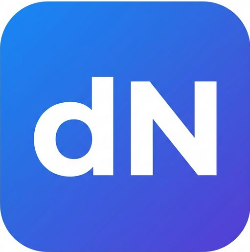
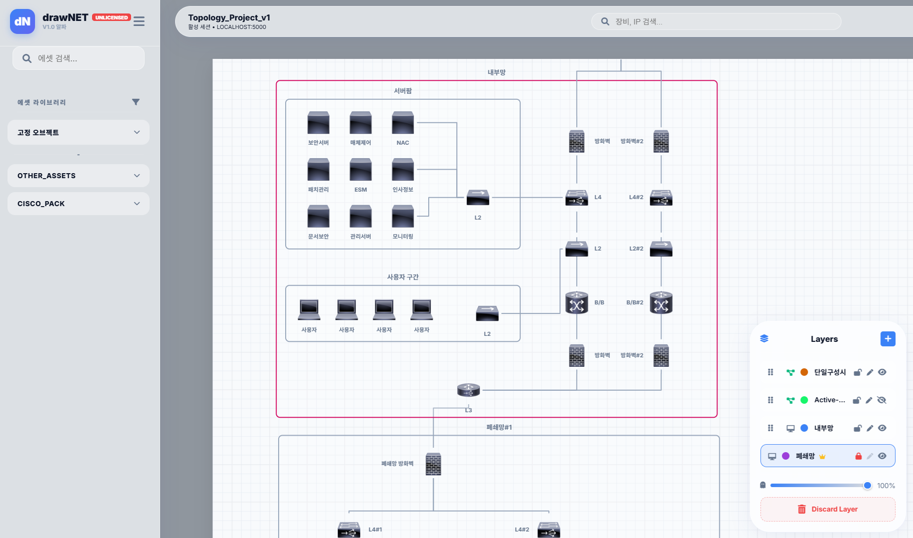

# drawNET - 엔지니어를 위한 고정밀 네트워크 아키텍처 설계 도구

<p align="center">
  
</p>

**drawNET**은 복잡한 IT 인프라와 네트워크 토폴로지를 설계하기 위해 개발된 전용 다이어그램 도구입니다. 엔지니어의 실무 경험을 바탕으로, 단순한 그림 그리기를 넘어 **데이터 무결성**과 **레이어 기반의 논리적 아키텍처**를 완벽하게 지원합니다.



---

## 🚀 주요 기능 (Key Features)

- **스마트 그룹화 및 계층 관리:** 노드 간의 포함 관계를 UUID 기반으로 관리하며, 중첩된 그룹 내에서도 가장 안쪽의 객체를 정확히 찾아내는 지능형 선택 시스템을 갖추고 있습니다.
- **논리적 멀티 레이어 (Multi-Layer):** '물리 레이어'와 '논리 레이어'를 구분하여 설계할 수 있습니다. 레이어 간 관통 스냅(Ghost Snapping)을 통해 복잡한 망 구조를 명확하게 시각화합니다.
- **프로페셔널 정밀 도구:** 
    - **Surgical Picker:** 겹쳐진 오브젝트를 포토샵처럼 리스트로 띄워 선택.
    - **Format Painter:** 노드 속성 및 선 스타일(라우팅 방식 포함) 대량 복제.
    - **Object Locking:** 설계 실수 방지를 위한 강력한 객체 고정 기능.
- **하이엔드 리포트 익스포트:** 단순 이미지를 넘어, 개별 객체가 살아있는 **전문가용 PPTX 및 PDF 리포트** 자동 생성 기능을 제공합니다.
- **오브젝트 스튜디오 (Object Studio):** 직접 찍은 사진이나 캡처 이미지를 즉시 고품질 SVG 벡터 아이콘으로 변환하여 나만의 자산 라이브러리를 구축할 수 있습니다.

---

## 📚 도움말 및 가이드 (Documentation)

공식 매뉴얼을 통해 drawNET의 기능을 100% 활용해 보세요.

- [**사용자 가이드 (Getting Started)**](./manual/guide.md): 기본적인 사용법과 워크플로우를 안내합니다.
- [**단축키 일람 (Shortcuts)**](./manual/shortcuts.md): 작업을 2배 더 빠르게 만들어주는 프리미엄 단축키 목록입니다.
- [**리치 카드 가이드 (Rich Card)**](./manual/rich_card.md): 도면에 풍부한 텍스트 정보를 추가하는 방법을 설명합니다.

---

## 💎 라이선스 및 가격 안내 (Pricing)

사용자의 필요에 따라 유연한 선택이 가능하도록 구독형(Monthly)과 일시불(Perpetual) 옵션을 모두 제공할 예정입니다.

| 구분 | **Community (Free)** | **Basic (Essential)** | **Pro (Enterprise)** |
| :--- | :---: | :---: | :---: |
| **권장 가격 (Monthly)** | $0 | **추후 확정 예정 (TBD)** | **추후 확정 예정 (TBD)** |
| **평생 소장 (Perpetual)** | - | **추후 확정 예정 (TBD)** | **추후 확정 예정 (TBD)** |
| **권장 대상** | 개인 학습 및 단순 설계 | 소규모 프로젝트 | 기업 / 전문 아키텍트 |
| **핵심 혜택** | 3개 레이어 제한 (알파 한정) | **무제한 레이어** | **모든 기능 포함** |
| **고급 기능** | 기본 라이브러리 | 서식 복사, 정밀 배치 도구 | **Object Studio (벡터화)** |
| **내보내기** | .dnet, PNG | + PDF, SVG | **+ PPTX 전용 리포트** |
| **기술 지원** | 커뮤니티 지원 | 이메일 문의 | 우선 순위 대응 |

> **알림:** 현재 drawNET은 **Alpha 버전**으로, 기능 검증 및 안정화 단계에 있습니다. 정식 버전(v1.0) 출시 전까지 모든 기능에 대한 가격 정책은 변경될 수 있으며, 알파 테스터에게는 추후 특별 혜택이 제공될 예정입니다.

### 🔑 Alpha 테스트용 공용 라이선스 키
알파 기간 동안 모든 기능을 자유롭게 테스트해 보실 수 있도록 공용 라이선스 키를 제공합니다. 시스템 메뉴의 **라이선스 관리** 탭에서 아래 키를 입력해 주세요.

```text
sP7nmTe1FXAcgki0hYVq4xxH2egDNBx2h4ZSdyS2s8inc9WA7W8MNRKWTsDZDj2BvnbdmVgfLuF76koFf3OvXPY6Mygvt76HBnWOd4sCGXPdAsFNaivCqWQP/lDUa6ruvVmtnajcGMWr4zqL/GfvEtHMrGa718CV1L/rYsy86eTRiUzMZe4rZ17V7uolq9hUtA2vIsli9qUIPZ0w9Gz9aIsJwgUbcW0lOAU6RYeVGinulMsWmGicS+AZl396FKvh0qp6on/yLw93QnbetEZ81GYUIESMv3DZslATCCzjb58fVJFSrZwdmvkq82pRY6wYPyOSPX0Fn7/AUMt+Fccxq9au8FrKeHgvd+gjY+k1KmOcT9QL6fK6ZbA8AR7e1gNCua1UvVlBApGnbnr7TStrVxRcH4n9Hl69JmWhEJpxHJ5VYrLHf9tcpti7ISHJGo6CyC1otr1/S0Io/QZFhZPqpGFBw93E/u2YiUG3Edud86exRo6IfFzaG8C5qG8UFkG0UcXU5JUmGBKt3gpr57vYLCH+AQWhY0D0O92N8G0hweWtXt5uVDWFtkFN9EWelEkSQ25uq1rcNZLdSBBwLpVkaa+ri8OIx6cekHs7a26ukbhAizYMSN2pkT3xFMfj5gVTtPl/HImzkSMXU2/PhRGixlZ5t2elsIMitqmal+KRB2B7Imh3aWQiOiAiVU5JVkVSU0FMIiwgImxldmVsIjogIkJhc2ljIiwgImxwaXJ5IjogIjIwMjYtMDQtMzAiLCAiaXNzdWVkIjogIjIwMjYtMDMtMjIifQ==
```

---

## 📥 설치 및 실행

### 필수 요구사항
- Python 3.9+
- Flask 및 하위 의존 라이브러리

### 실행 방법
```bash
# 저장소 복사
git clone https://github.com/leeyj78/drawNET.git
cd drawNET

# 의존성 설치
pip install -r requirements.txt

# 서버 실행
python app.py
```
접속 주소: `http://localhost:5000`

---

## ❤️ 후원 및 피드백 (Support)

drawNET은 개발자의 열정으로 만들어지고 있습니다. 이 프로젝트가 마음에 드셨다면 커피 한 잔의 여유를 선물해 주세요! 후원금은 서버 유지비와 기능 개발에 소중히 사용됩니다.

- **Ko-fi 후원:** [https://ko-fi.com/leeyj78](https://ko-fi.com/leeyj78)
- **문의 및 제안:** [leeyj78@gmail.com](mailto:leeyj78@gmail.com)
- **버그 제보:** [Issues](https://github.com/leeyj78/drawNET/issues) (Docs 참고)

---

## ⚖️ License

Copyright © 2026 drawNET Team. All Rights Reserved.
개인 사용자는 Community 라이선스로 시작하실 수 있으며, 기업 및 상업적 목적의 경우 원격 라이선스 활성화가 필요합니다. 상용 라이선스 관련 문의는 상기 이메일로 연락 주시기 바랍니다.
