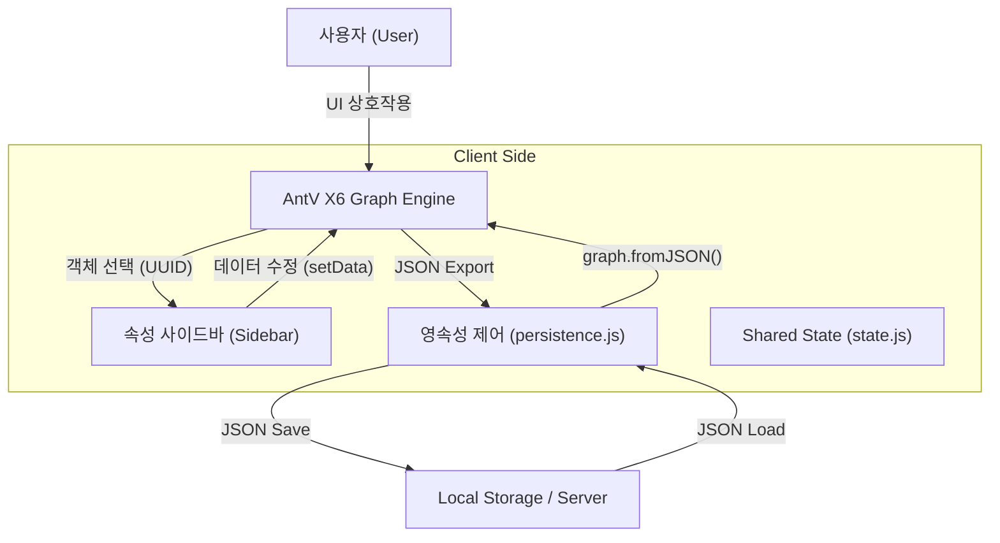

# drawNET System Architecture: Native JSON-Object Topology (v1.0)

> **"Programs must be written for people to read, and only incidentally for machines to execute."** — *Harold Abelson*  
> **"What is not documented, does not exist in the eyes of Engineering."** — *Software Engineering Proverb*

---

## 1. 개요 (Abstract)

drawNET은 단순한 다이어그램 그리기 도구를 넘어, 엔터프라이즈급 네트워크 토폴로지 설계 및 엔니지어링을 위한 **객체 지향적 시각화 프레임워크**입니다. 초기 DSL(Domain Specific Language) 기반의 텍스트 중심 구조에서 탈피하여, 고성능 그래프 엔진인 **AntV X6 v2**를 기반으로 한 **JSON-Native 아키텍처**로 진화했습니다. 본 시스템은 데이터의 영속성(Persistence), 정밀한 공간 쿼리(Spatial Query), 그리고 멀티레이어 논리 격리를 핵심 가치로 삼는 **v1.0 Premium Edition**입니다.

---

## 2. 설계 철학 (Design Philosophy)

### 2.1 Drawing에서 Engineering으로
기존 도구들이 시각적 표현에 집중했다면, drawNET은 **"데이터가 주도하는 시각화"**를 지향합니다. 모든 시각적 요소는 정규화된 데이터 모델의 하위 표현(View)에 불과하며, 핵심 로직은 UUID 기반의 객체 관계망에서 동작합니다.

### 2.2 하이브리드 인터페이스 (The Hybrid UI Strategy)
사용자에게는 직관적인 GUI(마우스 조작)를 제공하지만, 백그라운드에서는 모든 행위가 정형화된 JSON 스트림으로 변환되어 저장됩니다. 이는 향후 AI 기반의 토폴로지 자동 최적화 및 이상 탐지(Anomaly Detection)를 위한 학습 데이터셋 구축에 최적화된 구조입니다.

---

## 3. 핵심 아키텍처 모델 (Core Architecture Model)

drawNET은 **SSoT (Single Source of Truth)** 원칙에 따라 모든 상태를 단일 JSON 객체로 관리합니다.

### 3.1 논리 흐름 (Logical Workflow)
시스템의 데이터 처리는 다음과 같은 순환 구조를 따릅니다.

1.  **Interaction Layer**: 사용자의 드래그, 단축키, 속성 변경을 수집합니다.
2.  **Event Orchestration**: 객체 간 부모-자식 관계 변경(Embedding), 연결 상태 변경(Connecting) 이벤트를 감지하여 데이터 무결성을 검증합니다.
3.  **Data Transformation**: 변경된 상태를 X6 셀(Cell)의 `data` 속성에 즉각 반영합니다.
4.  **Persistence Layer**: 변경된 전체 그래프 상태를 `graph.toJSON()`으로 직렬화하여 영속 저장소(LocalStorage/Server)에 동기화합니다.

### 3.2 UUID 기반 객체 참조 (UUID-based Referencing)
모든 노드와 엣지는 시스템 전역에서 유일한 **UUID**를 식별자로 가집니다. 이는 **RFC4122 v4** 표준을 철저하게 준수하며, 라벨(Label)이나 명칭 변경 시에도 객체 간의 참조 무결성(Referential Integrity)이 깨지지 않도록 보장하며, 대규모 프로젝트에서 복잡한 계층 구조를 추적하는 핵심 메커니즘입니다.

### 3.3 시스템 구조도 (System Overview Diagram)

본 시스템의 모듈 간 상호작용과 데이터 흐름은 다음과 같습니다.

---

## 4. 멀티레이어 논리 격리 및 제어 (Multi-Layer & Logical Isolation)

drawNET은 단순히 선을 겹쳐 그리는 도구가 아닌, 복잡한 인프라를 **논리적 도메인(Domain)**으로 분리하여 관리하는 차세대 아키텍처를 채택했습니다. 이는 기존의 드로잉 도구(Draw.io, Visio 등)와 가장 극명하게 대비되는 drawNET만의 독보적 강점입니다.

### 4.1 Visual Layer vs. Logical Engineering Layer
| 비교 항목 | 기존 도구 (Visio, Draw.io) | **drawNET Premium** |
| :--- | :--- | :--- |
| **핵심 성격** | **Visual Layer** (시각적 그룹화) | **Logical Layer** (엔지니어링 격리) |
| **주요 용도** | 단순 Show/Hide (투명 비닐지 방식) | 도메인별 논리 격리 및 데이터 제어 |
| **데이터 일관성** | 레이어 간 복사 시 별개 객체로 분리 | 동일 UUID 기반의 다중 관점(View) 동기화 |
| **상호 작용** | 레이어 간 논리적 연동 불가 | Cross-layer Tunneling (계층 간 연동 추적) |
| **활용 가치** | "그림의 정리 정돈" | "복잡한 시스템의 통합 거버넌스" |

### 4.2 왜 '논리적 격리'인가? (The Reason Why)
엔터프라이즈급 인프라 설계에서 물리(Physical), 논리(Logical), 보안(Security) 데이터를 하나의 화면에 그리는 것은 불가능에 가깝습니다. drawNET은 이를 해결하기 위해 다음과 같은 고난도 기술을 구현했습니다.
1. **도메인 격리(Domain Isolation)**: L1(케이블/랙), L2(VLAN/IP), L3(보안 정책) 등 각 도메인의 정밀한 분리를 통해 설계의 복잡도를 낮추고 각 담당자가 본인의 영역에 집중하게 합니다.
2. **Single Source of Truth (SSOT)**: 1번 레이어의 '코어 스위치'와 3번 레이어의 '보안 장비'가 동일한 물리 장비라면, drawNET은 단 하나의 데이터 소스를 공유하여 어느 레이어에서 수정해도 전체 정합성이 유지되게 설계되었습니다. 
3. **지능형 터널링(Layer Tunneling)**: 레이어는 분리되어 있지만, 데이터 경로(Path)는 연결되어 있습니다. 물리적 케이블이 끊어졌을 때 논리 레이어의 패킷 흐름에 어떤 영향을 주는지 **교차 레이어 분석**이 가능합니다.

### 4.3 공간 쿼리 및 부모 선택 알고리즘 (Innermost Heuristic)
노드가 중첩된 그룹 영역으로 이동할 때, 시스템은 **Bounding Box 면적 기반의 Innermost 알고리즘**을 수행합니다. 
- **알고리즘**: 드롭 포인트를 포함하는 모든 부모 후보 중 면적이 가장 작은(가장 구체적인) 그룹을 최종 부모로 선택합니다.
- **의도**: 이를 통해 복잡한 랙(Rack) 및 사이트(Site) 계층 내부로의 직관적인 객체 삽입이 가능해집니다.

---

## 5. 저장 방식의 지향성과 확장성 (Storage & Scalability)

### 5.1 JSON-Native의 이점
- **VCS 친화성**: 텍스트 기반 JSON 파일로 저장되므로, Git과 같은 버전 관리 시스템을 통해 시나리오별 변경 이력을 관리하기 용이합니다.
- **상호운용성 (Interoperability)**: Python, JS 등 다양한 언어에서 표준 JSON 라이브러리를 통해 프로젝트 파일에 접근하여 자동화된 분석 보고서를 생성할 수 있습니다.

### 5.2 에셋 라이브러리 확장성 (Modular & Open Asset Architecture)
drawNET의 에셋 시스템은 폐쇄적�### 7. 전문 내보내기 서브시스템 및 하이브리드 리포팅 (High-Fidelity Export & Hybrid Reporting)

drawNET은 단순한 캔버스 캡처를 넘어, 엔지니어링 결과물의 시각적 완밀성과 데이터의 편집 가능성을 동시에 확보하는 **하이브리드 내보내기 전략**을 취합니다.

#### 7.1 하이브리드 이미지-객체 모델 (Hybrid Image-Object Model)
PPTX 리포트 생성 시, 시스템은 두 가지 서로 다른 렌더링 경로를 결합합니다.
1.  **Topology View (High-Res Snapshot)**: 복잡한 선(Path) 라우팅, SVG 그림자, 반투명 그룹 등은 PPTX 네이티브 객체로 변환 시 시각적 손실이 큽니다. 이를 방지하기 위해 200% 스케일의 고해상도 PNG 스냅샷으로 캔버스를 캡처하여 삽입합니다.
2.  **Inventory Data (Native PPTX Objects)**: 장비 목록, 프로젝트 정보, 요약 통계는 수정이 용이해야 합니다. 따라서 이 데이터는 PPTX의 네이티브 테이블(Table) 및 텍스트 상자로 생성하여, 리포트 출력 후에도 사용자가 파워포인트 내에서 직접 내용을 수정할 수 있도록 보장합니다.

#### 7.2 초정밀 클린 캡처 및 안정화 (Clean Capture & Stabilization)
내보내기 수행 시, 시스템은 실시간으로 **가상 스타일시트 주입(Virtual CSS Injection)** 및 **모사 데이터 동기화** 기술을 사용합니다.
- **UI 노이즈 제거**: 연결점(Port/Anchor), 선택 박스(Selection), 그리드 가이드 등을 캡처 순간에만 `display: none`으로 처리합니다.
- **적응형 안정화 지연 (1000ms Delay)**: 모델 업데이트(Base64 변환 등) 후 브라우저 DOM이 완전히 동기화되도록 1초의 대기 시간을 강제하여, 저사양 환경에서도 캡처 무결성을 보장합니다.
- **해상도 보정 (2x Scaling)**: 사용자 모니터의 DPI와 관계없이 항상 고품질 인쇄가 가능한 수준의 픽셀 밀도를 확보하기 위해 2배수 슈퍼 샘플링(Super Sampling) 캡처를 수행합니다.

#### 7.3 전수 속성 스캔 및 Base64 임베딩 (Recursive Asset Embedding)
SVG 내보내기의 핵심은 외부 자산의 완전한 자립화입니다.
- **재귀적 선택자 탐색**: 특정 태그에 국한되지 않고 노드의 모든 속성 트리를 스캔하여 외부 이미지 경로를 식별합니다.
- **속성 패리티(Parity)**: `xlink:href`와 일반 `href` 속성 모두에 동일한 Base64 데이터를 주입하여 크로스 브라우저/뷰어 호환성을 극대화합니다.
- **절대 좌표 매핑 (Zero-Clip)**: 캔버스의 현재 뷰포트 상태와 무관하게 `getCellsBBox`를 통한 실제 객체 영역을 자동 계산하고, 명시적인 `viewBox` 주입을 통해 상하좌우 짤림 현상을 원천 차단합니다.
상태, 환경 사양 등 무한한 메타데이터를 자유롭게 추가하고 수정할 수 있습니다.
- **데이터 활용성**: 모든 부가 정보는 JSON 데이터 모델에 정적/동적으로 포함되어 저장되므로, 설계가 완료된 후 즉시 인벤토리 보고서(Inventory Report) 생성, 검색 엔진 필터링, 혹은 외부 시스템과의 데이터 연동(API)에 활용됩니다.
- **설계 의도의 보존**: 이는 "그림"이 아닌 "설계 데이터" 그 자체를 보존함으로써, 설계자가 의도한 모든 엔지니어링 맥락이 유실 없이 영구적으로 관리됨을 의미합니다.

### 5.4 PM 지향적 설계 및 자산 관리 (PM-Centric Design & Asset Management)
엔지니어의 기술적 관점뿐 아니라, 프로젝트 매니저(PM)의 **의사결정 및 자산 관리 효율성**을 극대화합니다.
- **선제적 비즈니스 데이터 매핑**: 설계 초기 단계부터 각 객체에 벤더 정보, 단가(Price), 구매 일정, 담당 부서 등 관리 지표를 미리 입력할 수 있습니다. 
- **원클릭 전수 관리**: "Inventory View" 및 "JSON/PPTX Export" 기능을 통해 프로젝트에 투입된 전체 자산 현황과 예상 비용을 한눈에 파악할 수 있으며, 이는 즉시 구매 발주서나 예산 보고서의 기초 자료로 변환됩니다.
- **전략적 가시성**: 시각적 토폴로지와 비즈니스 데이터가 결합됨으로써, PM은 단순히 "어떻게 연결되는가"를 넘어 "무엇이 얼마의 비용으로 구축되는가"에 대한 전략적 통찰을 실시간으로 확보할 수 있습니다.

### 5.5 REST API 기반의 생태계 통합 (REST API-Based Ecosystem Integration)
drawNET의 데이터 구조는 고립된 파일에 머물지 않고 외부 시스템과 유기적으로 소통할 수 있는 **프로그래밍 가능한 인터페이스(Programmable Interface)**를 지향합니다.
- **Native REST API 지원**: Flask 기반의 강력한 백엔드를 통해 토폴로지 데이터의 CRUD(Create, Read, Update, Delete)를 REST API로 실시간 제공합니다. 
- **엔터프라이즈 시스템 연동**: 기업 내 CMDB(자산 관리 시스템), NMS(네트워크 모니터링), 혹은 클라우드 프로비저닝 엔진과의 양방향 데이터 동기화가 가능합니다. 
- **자동화된 생명주기 관리**: 외부 스크립트를 통해 새로운 프로젝트를 자동 생성하거나, 실시간 모니터링 데이터를 API로 수신하여 캔버스상의 노드 상태(장애 발생 등)를 시각적으로 즉시 갱신하는 등 고도화된 자동화 워크플로우를 구현할 수 있는 강력한 무기를 갖추고 있습니다.

---

## 6. 엔지니어링 생산성: 지능형 단축키 시스템 (Engineering Productivity: Intelligent Hotkey System)

drawNET은 일반적인 드로잉 도구(Draw.io, Visio 등)와 차별화되는 **"전문 엔지니어 전용 워크스테이션"**으로서의 정체성을 단축키 시스템을 통해 증명합니다.

### 6.1 "Always-Enabled" 로직의 기술적 의도
일반적인 웹 도구는 텍스트 입력 중 시스템 단축킹(Undo/Redo 등)이 차단되거나 포커스 충돌을 일으킵니다. drawNET의 단축키 엔진은 `isTyping` 상태를 정밀하게 인지하되, 핵심적인 그래프 제어 액션에 대해서는 **전역적 우선순위(Override Priority)**를 부여합니다. 이는 수천 개의 속성을 동시에 수정하는 현업 환경에서 작업의 연속성을 완벽하게 보장하는 설계입니다.

### 6.2 Drawing Tool vs. Engineering Tool
- **드로잉 도구 (Draw.io, Visio)**: 시각적 표현이 목적이므로 마우스 기반의 정교한 배치를 우선시하며, 단축키는 보조 수단에 불과합니다.
- **엔지니어링 도구 (drawNET)**: 토폴로지 구성 속도가 핵심입니다. 따라서 **"Zero-Mouse"** 워크플로우를 지향하며, 로직 기반의 정렬(Alignment), 속성 복제(Format Painter), 컨텍스트 기반의 부모-자식 포함 로직을 단축키 하나로 수행할 수 있도록 최적화되어 있습니다.

### 6.3 현업 최적화 컨텍스트 핸들러
단순한 좌표 이동을 넘어, `Grid Snapping` 연동 이동, `Large/Small Step` 이동, 그리고 레이어 가시성 퀵 토글 등 현업 엔지니어가 토폴로지 구성 시 가장 빈번하게 수행하는 동작들을 모듈화된 핸들러(`handlers/`)로 구현하여 응답성을 극대화했습니다. 

---

## 7. 전문 내보내기 서브시스템 및 하이브리드 리포팅 (High-Fidelity Export & Hybrid Reporting)

drawNET은 단순한 캔버스 캡처를 넘어, 엔지니어링 결과물의 시각적 완밀성과 데이터의 편집 가능성을 동시에 확보하는 **하이브리드 내보내기 전략**을 취합니다.

### 7.1 하이브리드 이미지-객체 모델 (Hybrid Image-Object Model)
PPTX 리포트 생성 시, 시스템은 두 가지 서로 다른 렌더링 경로를 결합합니다.
1.  **Topology View (High-Res Snapshot)**: 복잡한 선(Path) 라우팅, SVG 그림자, 반투명 그룹 등은 PPTX 네이티브 객체로 변환 시 시각적 손실이 큽니다. 이를 방지하기 위해 200% 스케일의 고해상도 PNG 스냅샷으로 캔버스를 캡처하여 삽입합니다.
2.  **Inventory Data (Native PPTX Objects)**: 장비 목록, 프로젝트 정보, 요약 통계는 수정이 용이해야 합니다. 따라서 이 데이터는 PPTX의 네이티브 테이블(Table) 및 텍스트 상자로 생성하여, 리포트 출력 후에도 사용자가 파워포인트 내에서 직접 내용을 수정할 수 있도록 보장합니다.

### 7.2 초정밀 클린 캡처 메커니즘 (Clean Capture Mechanism)
내보내기 수행 시, 시스템은 실시간으로 **가상 스타일시트 주입(Virtual CSS Injection)** 기술을 사용하여 시각적 노이즈를 제거합니다.
- **UI 노이즈 제거**: 연결점(Port/Anchor), 선택 박스(Selection), 그리드 가이드 등을 캡처 순간에만 `display: none`으로 처리하여 설계 데이터 본연의 모습만 선명하게 담아냅니다.
- **해상도 보정 (2x Scaling)**: 사용자 모니터의 DPI와 관계없이 항상 고품질 인쇄가 가능한 수준의 픽셀 밀도를 확보하기 위해 2배수 슈퍼 샘플링(Super Sampling) 캡처를 수행합니다.

### 7.3 레이어 기반 수직적 리포팅 (Layer-Aware Vertical Reporting)
전체 토폴로지뿐 아니라, 프로젝트에 정의된 각 레이어(물리, 논리, 보안 등)를 개별적으로 분석하여 슬라이드를 생성합니다.
- **동적 가시성 제어**: 각 레이어별 전용 슬라이드를 캡처할 때, 시스템은 백그라운드에서 레이어 가시성을 순차적으로 토글(Toggle)하고 필터를 적용하여 해당 도메인의 객체들만 깨끗하게 분리된 자동 리포트를 구성합니다.

#### 7.4 엔지니어링 실무 데이터 매핑 (Engineering Data Mapping)
- **식별자 기반 매핑 (ID-Key Linkage)**: drawNET의 모든 객체는 고유 UUID를 Primary Key로 가집니다. 이는 실무 엔지니어가 보유한 방대한 외부 데이터(라우팅 테이블, 방화벽 룰 등)와 시각적 도면을 VLOOKUP이나 데이터 조인으로 즉시 연결하는 매개체가 됩니다.
- **경량 메타데이터 레이어 (Description & Tags)**: 도면의 가벼움을 유지하면서도 실무에 꼭 필요한 컨텍스트를 `Tags`와 `Description`으로 캡처합니다. 이는 "무거운 데이터 관리는 외부 전문 툴에 맡기고, 도면은 맥락과 연결 고리만 제공한다"는 실무적 철학을 반영합니다.
- **BOM 및 인벤토리 자동 생성**: 인벤토리 내 '소속 그룹' 정보를 포함하여, 내보낸 즉시 자산 관리 대장(Excel)으로 활용 가능한 고순도 데이터를 제공합니다.

---

## 8. Connectivity & Simulation Architecture (논리적 연결 계층화)
drawNET은 물리적 자산 배치와 논리적 연결 시뮬레이션을 분리하기 위해 **'레이어 타입 기반 제약(Layer-Type Constraints)'** 아키텍처를 채택합니다.
### 8.1 레이어 타입 정의
- **Standard (Physical)**: 장비(Node)와 연결(Edge)이 공존하는 기본 레이어.
- **Logical (Simulation)**: 연결선(Edge)만 허용되는 특수 레이어. 신규 노드 생성이 차단되며, 복제 시 노드는 필터링되고 연결 관계만 전이됩니다.
### 8.2 데이터 일관성 및 시뮬레이션 원칙
- **SSoT (Single Source of Truth)**: 장비의 마스터 정보는 물리 레이어에 위치하며, 논리 레이어의 선들은 서로 다른 레이어에 속한 노드들을 참조(UUID 기반)하여 가상의 망 구성을 형성합니다.
- **포맷 페인터(Style Propagation)**: 클립보드 데이터를 최우선으로 하는 `Default-Strict` 로직을 통해 개체의 스타일 정보가 유실 없이 전파되도록 보장합니다.
- **자기 치유형 상태 관리**: 브라우저 및 OS 레벨의 이벤트 유실에 대비하여, 인터랙션 발생 시마다 실제 모디파이어(Ctrl/Cmd) 상태를 재검증하는 안정성 프로토콜을 운영합니다.

## 9. AI Ready: 구조화된 그래프 데이터의 가치 (AI Ready: The Value of Structured Data)

drawNET은 단순히 도면을 "그리는" 도구가 아니라, **AI가 즉시 이해하고 분석할 수 있는 고정밀 데이터셋**을 생성하는 플랫폼입니다.

### 9.1 데이터 고정밀도 (Data High-Fidelity)
기존의 PDF나 이미지(OCR 기반) 도면 분석은 시각적 모호성으로 인해 연결 관계의 왜곡이나 오인식 확률이 높습니다. drawNET의 JSON-Native 구조는 모든 연결을 UUID와 참조 무결성(Referential Integrity)으로 정의하므로, AI에게 **"정답(Ground Truth)"**을 제공합니다. 이는 AI 모델의 학습 및 분석 정확도를 비약적으로 높여줍니다.

### 9.2 지능형 설계 감사 및 예측 (Intelligent Auditing & Prediction)
구조화된 데이터 모델은 차세대 AI 엔진과 결합하여 다음과 같은 가치를 창출합니다:
- **자동 설계 검증 (Automated Auditing)**: 설계된 토폴로지가 기업의 보안 정책이나 표준망 구성 원칙을 준수하는지 AI가 실시간으로 감시하고 이상 징후를 탐지합니다.
- **장애 시뮬레이션 (Impact Analysis)**: 특정 노드 장애 시 전체 서비스에 미치는 영향도를 그래프 알고리즘으로 자동 계산하여 최적의 백업 경로를 제안합니다.
- **비용 최적화 (TCO Optimization)**: 입력된 단가와 장비 스펙 데이터를 AI가 분석하여, 운용 효율은 유지하면서도 구축 비용을 최소화할 수 있는 설계 최적화 모델을 제시합니다.

### 9.3 그래프 알고리즘과의 완벽한 호환성
본 프로젝트가 생성하는 데이터는 **그래프 이론(Graph Theory)**을 따르는 인접 리스트(Adjacency List) 구조로 즉시 변환 가능합니다. 이는 LLM(대형 언어 모델)뿐만 아니라 GNN(Graph Neural Networks)과의 결합을 통해 네트워크 인프라의 미래를 설계하는 데 가장 적합한 아키텍처임을 증명합니다.

### 9.4 네트워크 가상 시뮬레이션 및 디지털 트윈 (Network Virtual Simulation & Digital Twin)
drawNET의 데이터는 단순한 시각화를 넘어, 가상 환경에서의 **패킷 흐름 시뮬레이션**을 가능케 하는 디지털 트윈의 기반이 됩니다.
- **라우팅 루프 및 블랙홀 탐지 (Loop & Blackhole Detection)**: 엔터프라이즈 네트워크의 고질적인 문제인 라우팅 루프를 설계 단계에서 사전에 차단합니다. 객체의 `tags`에 포함된 라우팅 정보와 `ip` 속성을 그래프 경로 탐색 알고리즘과 결합하여, 논리적 순환 경로(Loop)나 목적지 없이 사라지는 경로(Blackhole)를 AI가 0.1초 만에 전수 검사합니다.
- **물리-논리 정합성 검증**: 물리적 케이블 연결(Edge)과 논리적 라우팅 정책(Metadata) 사이의 불일치를 잡아내어, "그림과 실제 설정이 다른" 휴먼 에러를 원천적으로 방지합니다.

### 9.5 AI 범용성 및 미래 지향성 (Universal AI-Agnostic Architecture)
drawNET이 생성하는 데이터 모델은 특정 AI 기술에 종속되지 않는 **"범용 AI 데이터 언어"**로서의 가치를 지닙니다.
- **Cross-AI Compatibility**: OpenAI(GPT), Anthropic(Claude), Meta(Llama) 등 모든 주요 AI 모델들은 시각적 이미지보다 정형화된 JSON 데이터에서 강력한 추론 능력을 발휘합니다. drawNET은 어떤 AI가 등장하더라도 즉시 협업할 수 있는 완벽한 인터페이스를 미리 갖추고 있습니다.
- **데이터 주권과 보안 (Data Sovereignty)**: 클라우드 기반 AI를 사용할 수 없는 고도의 보안 환경에서도, 표준 JSON 형식의 프로젝트 파일을 로컬 AI 엔진(On-premise LLM)이 직접 분석하게 함으로써 데이터 외부 유출 없이도 지능형 설계를 수행할 수 있습니다.
- **공공 및 국가 중요 시설 최적화**: 망 분리 환경이 필수적인 공공기관, 금융, 국방 분야에서 폐쇄형 LLM과의 결합을 통해 **보안 가이드라인 준수 여부(Compliance Audit)**를 자동 검증할 수 있습니다. 이는 인적 과실로 인한 국가적 보안 사고를 설계 단계에서 원천 차단하는 가장 강력한 보안 설계 아키텍처임을 보장합니다.
- **미래를 위한 확장팩**: 현재 입력된 `tags`, `ip`, `metadata` 등은 미래의 강력한 AI 에이전트가 네트워크 인프라를 자동으로 정밀하게 제어(Autonomous Networking)할 수 있게 만드는 핵심 데이터 전구체(Precursor) 역할을 수행합니다.

---

## 10. 미래 전망 및 지향점 (Future Direction)

1.  **AI Topology Auditor**: 저장된 JSON 데이터를 분석하여 네트워크 설계상의 병목 구간이나 단일 장애점(SPOF)을 AI가 자동으로 식별하는 기능을 계획하고 있습니다.
2.  **Visual Diff Engine (Next Gen)**: 두 개의 프로젝트 JSON 파일을 비교하여 노드 위치 변화, 속성 변화를 캔버스상에 시각적으로 강조(Highlight)하는 도구로 발전시킬 것입니다.
3.  **Master Model Definition**: 하나의 마스터 모델에서 다양한 관점의 서브 그래프(View)를 동시에 생성하고 동기화하는 엔터프라이즈 협업 기능을 지향합니다.

---

*최초 공식 릴리즈: 2026-03-20 (v1.0 Premium Edition - New Launch)*  
*작성자: Antigravity AI Implementation Team (drawNET Core)*
